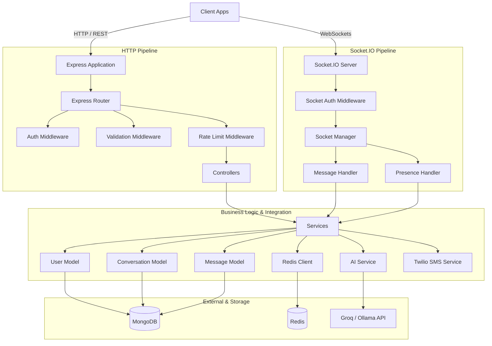

# Neurova Backend Architecture

Neurova is a highly secure, private messaging application featuring advanced real-time communication and client-decrypted AI integrations (Smart Replies, Conversation Summarization, and Task Extraction). 

This document details the architectural layout, core design patterns, database schemas, security models, and real-time flows implemented in the Neurova backend.

---

## 1. High-Level Architecture Overview

The Neurova backend follows a **Layered Architecture** with strict separation of concerns, decoupling HTTP routes, controllers, services, database models, and external API integrations.



### Server Execution Lifecycle
1. **Bootstrap (`server.ts`)**: Initializes database connections (MongoDB and Redis), creates the raw HTTP server, binds Express and Socket.IO to the same origin, and initializes global singletons (e.g., `socketManager`).
2. **Graceful Shutdown**: Intercepts `SIGTERM`, `SIGINT`, and `unhandledRejection` signals. It stops accepting new Socket.IO connections first, terminates the HTTP server, and closes database sockets, ensuring no pending requests or socket transactions are abruptly terminated.

---

## 2. Technology Stack

*   **Runtime Environment**: Node.js
*   **Language**: TypeScript (compiled with strict type checking)
*   **Web Framework**: Express (v5.x)
*   **Real-time Protocol**: Socket.IO (v4.x)
*   **Primary Database**: MongoDB (object data modeling via Mongoose)
*   **Caching & Coordination**: Redis (ioredis)
*   **Validation Layer**: Zod (for environment variables and API request bodies)
*   **External SMS Integration**: Twilio
*   **Large Language Models (AI)**: Groq (production tier) and Ollama (local development tier)

---

## 3. Core Architectural & Design Patterns

### 3.1. Thin Controllers, Rich Services
Controllers are strictly entry/exit boundaries. They:
1. Read HTTP parameters and request payloads.
2. Delegate execution to dedicated service instances.
3. Map service outputs (or thrown exceptions) into unified HTTP responses.
No business or persistence logic is written in controllers, which ensures easy testability.

### 3.2. Fail-Fast Configurations (`config/env.ts`)
Environment configurations are parsed and validated at boot time using a strict Zod schema. If a required configuration (e.g., `MONGODB_URI`, `JWT_SECRET`, `GROQ_API_KEY`) is missing or malformed, the process logs a detailed validation error and terminates immediately.

### 3.3. Persist-First Message Delivery
To prevent message loss in shaky network environments:
1. When a client emits a message over Socket.IO, the server **persists** it to MongoDB first.
2. Once persisted, the server acknowledges receipt back to the sender (resolving the sender's UI to a "sent" state).
3. The server then attempts real-time dispatch to the receiver's active socket(s).
4. If the receiver is offline, the message remains safely in the DB under status `"sent"` and is automatically retrieved when they reconnect.

### 3.4. Abstracted Provider Model for AI (`ai/providers/`)
The backend decouples LLM generation using a provider design pattern. The `aiService` calls `getAIProvider()` which returns an implementation adhering to the `AIProvider` contract:
```typescript
export interface AIProvider {
  complete(systemPrompt: string, userPrompt: string): Promise<string>;
  isAvailable(): Promise<boolean>;
}
```
This enables swapping between **Groq** and **Ollama** dynamically using a single environment variable change (`AI_PROVIDER=groq|ollama`), without altering any core AI processing logic.

### 3.5. Multi-Device Presence Map (`socket/socketManager.ts`)
To handle users connected on multiple devices (e.g., mobile app and web client), the Socket Manager maintains an in-memory `Map<string, Set<string>>` mapping `userId` to a `Set` of active `socketId`s.
*   **Delivery**: Messages are dispatched to *all* socket IDs belonging to the recipient.
*   **Online Status**: A user is considered online as long as their set of active socket IDs is greater than zero.

---

## 4. Database Schema & Indexing Design

The database layer utilizes MongoDB (Mongoose) with explicit indexing tailored to the query profiles of private messaging.

### 4.1. User Schema (`User.model.ts`)
Represents user identities and keys.
```typescript
interface IUser {
  phone: string;       // Unique identifier
  name?: string;       // Display name
  avatar?: string;     // URL path to profile image
  publicKey?: string;  // Client-generated RSA/ECDH public key (used for E2EE negotiation)
  lastSeen?: Date;     // Null if online, otherwise timestamp of disconnect
  deviceTokens: string[]; // FCM/APNs push tokens
}
```
*   **Indices**:
    *   `phone`: Unique index implicitly created.
    *   `lastSeen: -1`: Efficient lookup for sorting contact lists by activity.

### 4.2. Conversation Schema (`Conversation.model.ts`)
Models the metadata of conversations (1-on-1 chats and group chats).
```typescript
interface IConversation {
  members: Types.ObjectId[];
  type: "direct" | "group";
  status: "pending" | "accepted" | "rejected";
  requestedBy: Types.ObjectId;
  lastMessage?: {
    encryptedPreview: string;
    senderId: Types.ObjectId;
    createdAt: Date;
  };
  groupName?: string;
  groupAvatar?: string;
}
```
*   **Indices**:
    *   `{ members: 1 }` & `{ members: 1, status: 1 }`: Fetching a user's conversations.
    *   `{ members: 1, updatedAt: -1 }`: Quick-sorting of the conversation list.
    *   `{ members: 1, type: 1 }` (Unique, partial filter: `type: "direct"`): Strictly prevents duplicate direct chats between the same pair of users.

### 4.3. Message Schema (`MessageSchema.ts`)
Persists individual message payloads.
```typescript
interface IMessage {
  conversationId: Types.ObjectId;
  senderId: Types.ObjectId;
  encryptedText: string;  // Encrypted content string
  iv: string;             // Cipher initialization vector
  type: "text" | "image" | "file" | "voice";
  status: "sent" | "delivered" | "read";
  readBy: { userId: Types.ObjectId; readAt: Date }[];
  isDeleted: boolean;     // Soft deletion
}
```
*   **Indices**:
    *   `{ conversationId: 1, createdAt: -1 }`: Primary index used for loading paginated chat history.
    *   `{ conversationId: 1, status: 1 }`: Fast retrieval of undelivered messages when a user reconnects.
    *   `{ senderId: 1, createdAt: -1 }`: Auditing and message tracking.

### 4.4. OTP Schema (`OTPSchema.model.ts`)
Short-lived documents for SMS authorization.
```typescript
interface IOTP {
  phone: string;
  hashedOTP: string;
  attempts: number;
  expiresAt: Date;
}
```
*   **Security & TTL Indexing**:
    *   `{ expiresAt: 1 }` with `{ expireAfterSeconds: 0 }`: Uses MongoDB's background thread to automatically purge expired tokens.
    *   To safeguard against MongoDB's TTL thread lag (which runs once every 60 seconds), the service layer also performs explicit date comparisons before validating.

---

## 5. Security & Privacy Model

Neurova enforces modern privacy practices to ensure zero server-side exposure to plaintext data.

```
[Sender] --(Encrypted Payload)--> [Server] --(Persists Encrypted)--> [Database]
                                     |
                                     +--(Dispatches Encrypted)------> [Receiver]
```

### 5.1. Zero-Knowledge Messaging
*   **Client-Side Encryption**: Messages are encrypted end-to-end on the client before being sent.
*   **Cipher Transport**: The server only receives `encryptedText` and its `iv`. It has no access to the client's private keys and cannot decrypt standard chat messages.

### 5.2. Ephemeral AI Processing Pipeline
While messaging is end-to-end encrypted, Neurova supports server-side AI features. To enable this securely without exposing keys:
1. When a user requests an AI operation (e.g. Smart Reply), the client decrypts the relevant messages in-memory.
2. The client transmits the plaintext messages to `/api/v1/ai/process` over a TLS/HTTPS connection.
3. The server validates the request, constructs the prompt, sends it to the LLM (Groq/Ollama), receives the output, and returns the response.
4. **Important**: Plaintext payloads exist strictly inside the memory footprint of the request handler lifecycle. They are **never persisted** to MongoDB, Redis, or local logs. The `conversationId` is passed strictly for logging and rate-limiting audit paths, never forwarded to the AI models.

### 5.3. API Rate Limiting
*   **OTP Requests**: Rate limited at the Redis layer using the phone number (`otp_rate:<phone>`). Generates a sliding 15-minute window allowing a maximum of 5 SMS dispatch requests.
*   **AI Endpoint Requests**: To prevent API key/cost exhaustion, `/api/v1/ai/process` enforces a strict authenticated rate limit of **20 requests per hour per user**, managed dynamically via Redis (`ai_rl:<userId>`).

---

## 6. Socket.IO Real-time & Presence Lifecycle

The real-time layer is structured around event emission channels using Socket.IO.

### 6.1. Connection Authorization
Clients must supply a valid JWT during the WebSocket handshake:
`socket = io(SERVER_URL, { auth: { token: "Bearer <jwt>" } })`
The `socketAuthMiddleware` parses the handshake token, verifies it via `tokenService`, ensures the user exists, and attaches the `userId` directly to the socket context.

### 6.2. Room Topology
Upon connection:
1. The server queries the database for all conversations where the user's status is `"accepted"`.
2. The socket joins rooms designated by the conversation IDs: `socket.join(conversationId)`.
3. Message broadcasts are sent to specific rooms: `io.to(conversationId).emit(...)`.

### 6.3. Contact-Only Presence Broadcasts
Rather than broadcasting presence changes globally, Neurova restricts updates for efficiency and privacy:
1. On socket connection/disconnection, the server searches for conversations the user is in.
2. It aggregates a distinct list of conversation members (contacts).
3. The server iterates over this contact list and sends `presence_update` events *only* to active sockets of those direct contacts.

### 6.4. Reconnection Handling (Offline Delivery Queue)
When a client joins a room:
1. The server checks the `Message` model for any messages in that conversation with `status: "sent"` where `senderId` is not the current user.
2. These undelivered messages are emitted to the client in chronological order under the `undelivered_messages` event.
3. The server transitions their status to `"delivered"` and emits a status update back to the original senders.

---

## 7. AI Prompt Engineering & Processing

The `aiService` coordinates request parsing, prompt generation, and strict response parsing.

### 7.1. Feature Prompt Engineering Configurations

#### A. Smart Reply (`reply.prompt.ts`)
*   **System Instructions**: Context is capped to the last `maxMessagesForReply` messages. The engine is instructed to match the tone (formal, casual, emoji usage) of the dialogue, keep outputs between 2-12 words, and output a strict JSON array of 3 candidate strings.
*   **LLM Example Pattern**: `["Sounds good!", "I'll be there", "Can we reschedule?"]`

#### B. Conversation Summarization (`summarize.prompt.ts`)
*   **System Instructions**: Maximum of 3 to 5 objective, third-person sentences. Focuses purely on key decisions and outcomes. Returns a single-sentence fallback if the thread is too brief for an informative summary.

#### C. Task Extraction (`tasks.prompt.ts`)
*   **System Instructions**: Scans the conversation history for explicit commitments. Attributes actions explicitly in the format `"Person: task description"`. Hallucinations are restricted by hard instruction ("Do not infer..."). Returns `[]` if no clear commitments are found.

### 7.2. Defensive JSON Extraction
LLMs often wrap JSON outputs inside Markdown blocks (e.g. ` ```json ... ``` `). The parser runs defensive regex sanitization (`stripMarkdownCodeFences`) to clean the string before invoking `JSON.parse`.
If the parsing fails, a specific `ApiError.internal` error is generated, and the raw payload is logged privately to the server logs for diagnostic review rather than being exposed to the client.
